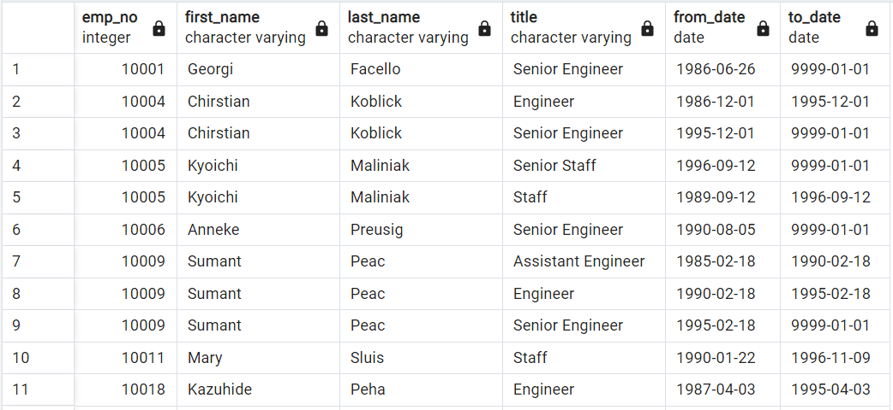
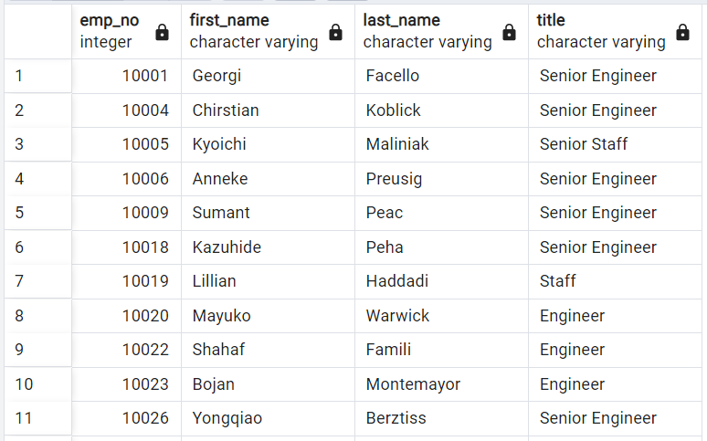
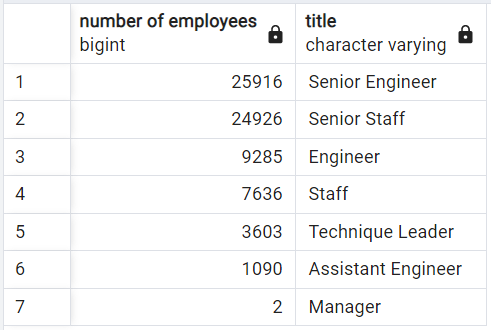
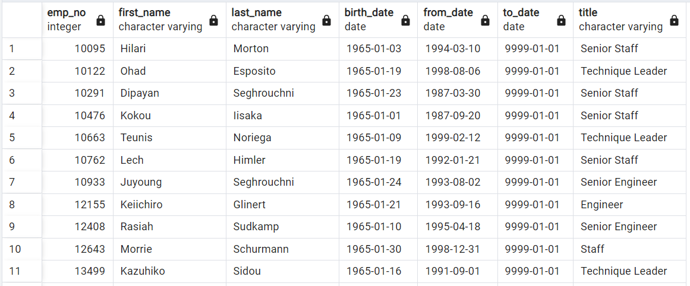

# Pewlett-Hackard-Analysis

## Overview of Pewlett-Hackard Analysis
Pewlett-Hackard is faced with a large number of their employees looking closer to retirement. This will leave the company with a number of positions to fill in the future. We were tasked to help Bobby perform an analysis on Pewlett-Hackard's employees to help determine eligibility into their retirement program and upcoming vacant positions. The company wants to look at the retiring employees by department and title to better understand the vacancies that will be coming up. Additionally the company wants to start a mentorship program to help ease the transition of retiring employees. We are also tasked with providing a list of employees that are eligible for the mentorship program.

## Results from Pewlett-Hackard Analysis

**Gathering the group of retirement-ready employees by title.**

This data was extracted by joining the employee and titles tables using the employee number (emp_no) and filtering the data to those employees that were born between 1952 and 1955. From this data we originally see that there are 133,776 rows but can also see that there are duplicates of employees and employees that are no longer at the company. Having Pewlett-Hackard use this number before additional filtering would strongly skew the estimate of retirement-ready employees.

**Filtering down the retirement-ready group of employees to only current employees and their most recent title.**

To get an accurate number of retirement-ready employees for Pewlett-Hackard we will need to filter out all the employees that are no longer with the company making the to_date = 1999-01-01 as well as using the distinct on function to only get the current Pewlett-Hackard employees with their most recent title. Now with the unique titles table, we can see that there are only 72,458 retirement-ready employees, a number that is more palatable for the company.

**Counting the number of retirement-ready employees that make up each title.**

Of the 72,458 positions opening due to future upcoming employee retirements there are only 7 different titles those employees make-up with the vast majority being Senior level Engineers and Staff. This could offer the opportunity that more entry and mid level Engineers and Staff are ready to move up which could ease training. This data was extracted by running a count of each title from the unique titles table.

**Gathering the list of employees eligible for the mentorship program.**

We can see that there are 1,549 employees eligible for the mentorship program. We got this number by joining the department employee, employees, and titles tables and then filtering birth_date of 1965 and to_date of 1999-01-01. We also used the distinct on function to remove any duplicate employee names.

## Summary of Pewlett-Hackard Analysis

**Upcoming Silver Tsunami**

There will be 72,458 total roles that will need to be filled with the upcoming silver tsunami.

There are enough retirement-ready employees (72,458) in each department to mentor the group of mentorship eligible employees (1,549) in those departments as seen in the below table. In theory this group would be responsible for helping train the new employees that will replace the retiring employees which would be about 45 newly hired employees per the employees in the mentorship eligible list.

**Additional Analysis Recommendations**

As for additional data, I would recommend getting to dive deeper into Hewlett-Packard’s Silver Tsunami counts for by department and title for the mentorship eligible employees to see if there are any gaps between those retiring and those entering the mentorship program. This would be a new column joining the retiring_titles table to get the count by title of retirement-ready and mentorship eligible side by side. Then we would create a new table swapping title for the department.

Another piece of additional data I would look into is increasing the amount of employees that would be eligible for the mentorship. We looked at people that had a birth year of 1965 but we could also add people that have been newly hired as well with hire_date. Right now the mentor eligible group is 2.1% of the retirement-ready group.

The last additional data I might look at is which remaining employees are the most senior in their position and/or department as they would likely be eligible to replace the senior positions left open by the retiring group. 
